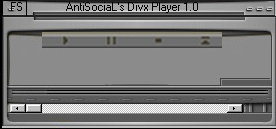



## AVI Player Using MCI API Calls

### Description

Shows how to use MCI API to play AVI Video Files, give it a look (and vote for me?). Enjoy it!
 
### More Info
 

             |
---                |---
**Submitted On**   |2000-10-24 06:43:18
**By**             |[AntiSociaL](https://github.com/Planet-Source-Code/PSCIndex/blob/master/ByAuthor/antisocial.md)
**Level**          |Advanced
**User Rating**    |4.3 (13 globes from 3 users)
**Compatibility**  |VB 6\.0
**Category**       |[Graphics](https://github.com/Planet-Source-Code/PSCIndex/blob/master/ByCategory/graphics__1-46.md)
**World**          |[Visual Basic](https://github.com/Planet-Source-Code/PSCIndex/blob/master/ByWorld/visual-basic.md)
**Archive File**   |[CODE\_UPLOAD1091610242000\.zip](https://github.com/Planet-Source-Code/antisocial-avi-player-using-mci-api-calls__1-12263/archive/master.zip)

